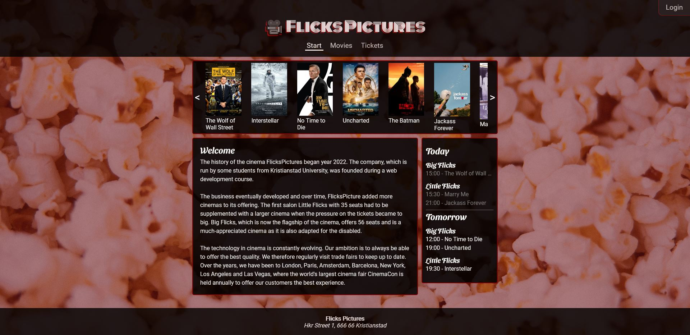

# Flicks-Pictures

Cinema website project for the course "Software development for the Web" at Kristianstad University.

Vanilla JS, Node.js, Express, Sqlite3

Rest-API with Access control lists (ACL).

# Features
- Movies
    - See a list of current movies with showings
    - Filtering by age and date
    - Movie-details page with YT trailerz, additional info, reviews and booking functionality
 - Tickets
    - Date and movie selection
    - Responsive UI to select seats
    - Booking functionality, with email confirmation
    - "Double booking" prevention
    - Three ticket prices (children, adults, senior)
- Movie-scroller
    - Scrolling through available movies
    - On pressing movie, takes you to details page for that movie
- Upcoming showings sidebar
    - Automatically updates today's and tomorrow's showings
    - Greyed out titles, when movie has already started 
- My bookings
    - Booking history
    - See details (seat numbers etc) of your booking
    - Remove booking
 - Account creation
    - Create account, with secure checks
    - Password hashing
 - Design
    - Responsive
    - Works on all screen sizes

# Prerequisities
Node.js

Visual Studio Code

# Getting started
It should be fairly straightforward to run the project. 

1. Clone project
2. run npm install
3. run node index
4. Site should be available at localhost:3000
5. Enjoy
